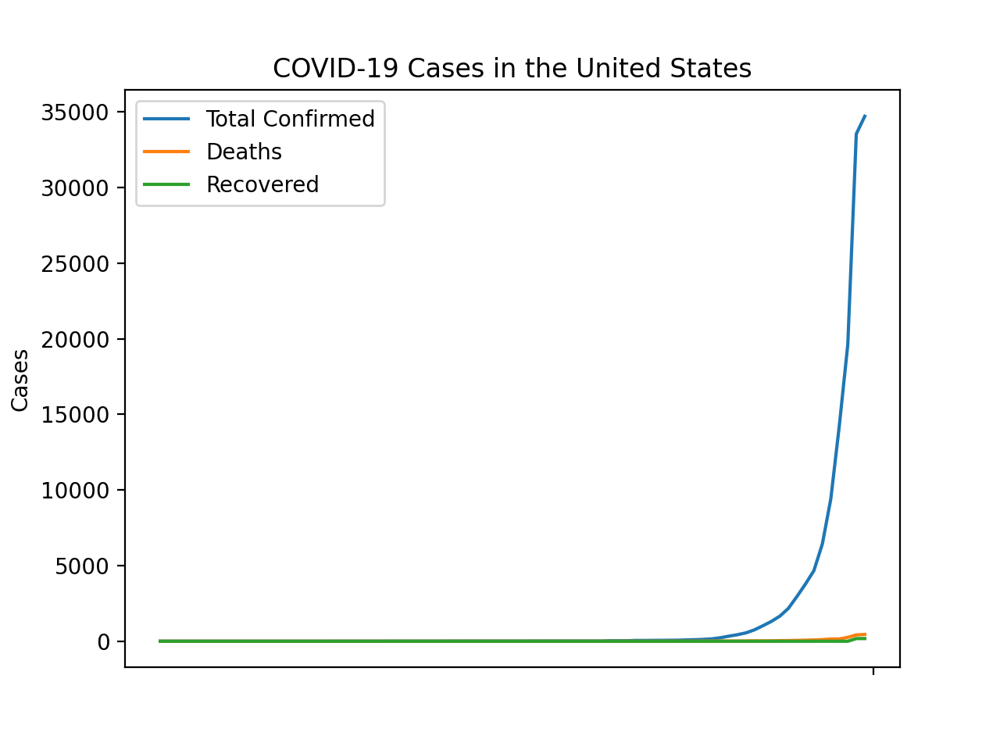

# COVID-19 Automated Update
Web scraper and data analysis for COVID-19 

## Modules Used:

Library:      | Purpose:
------------- | -------------
Beautiful Soup  | Web Scraping
Requests  | URL Requests
MatPlotLib | Visualizing Data
NumPy | Data Structure
CSV | Data Reading
<p align="center">
   
</p>
<table style="width:100%">
  <tr>
    <th>Modules</th>
    <th>Purpose</th> 
  </tr>
  <tr>
    <td>Beautiful Soup</td>
    <td>Web Scraping</td>
  </tr>
  <tr>
    <td>Requests</td>
    <td>URL Requests</td>
  </tr>
  <tr>
    <td>Matplotlib</td>
    <td>Visualizing Data</td>
  </tr>
  <tr>
    <td>Numpy</td>
    <td>Data Structure</td>
  </tr>
</table>

## This Script Consists of 6 Main Functions:
```Python3
def scrapeNumbers(URL, inputClass):
```
This function requests the `URL` and finds the HTML div with the label of `inputClass` and returns data collected from the website
```Python3
def getSavedData():
 ```
 This function return two arrays: `dateArray` and `data`
 The arrays are pulled from a .txt file that contains dates and their respective set of data
```Python3
def addTo(date, data):
 ```
 This function adds the `date` and `data` to the .txt file
 ```Python3
 def getPastData():
 ```
 This function reads the CSV files within the file `total_cases.csv` and `total_deaths.csv` and adds the data for the United States to the .txt file
 ```Python3
 def update():
 ```
 This function updates the .txt file with the data for the current day
 ```Python3
 def plot():
 ```
 This function contains the styling and functions of the plot 
